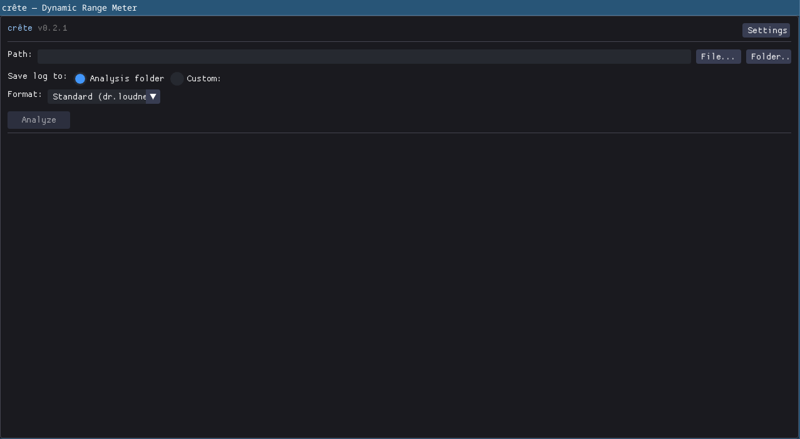
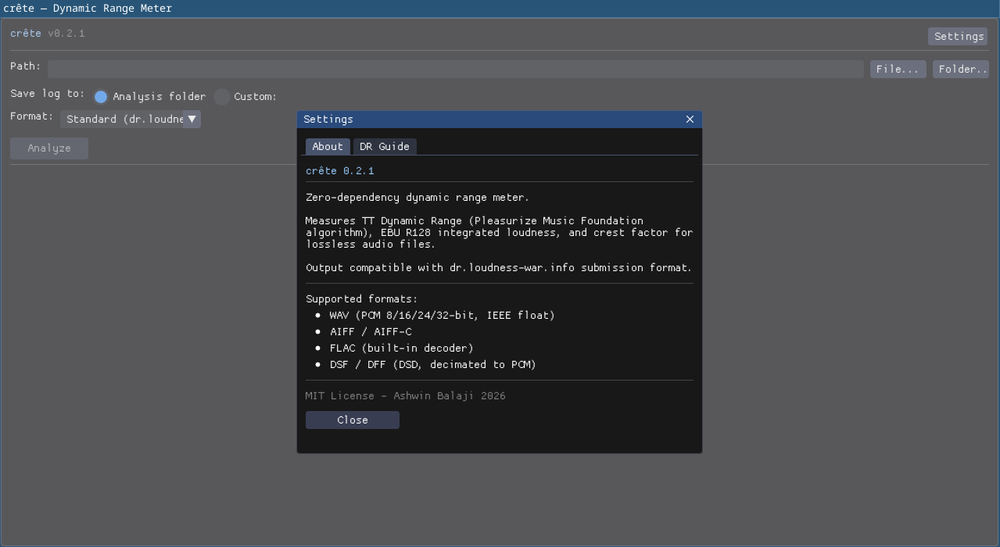
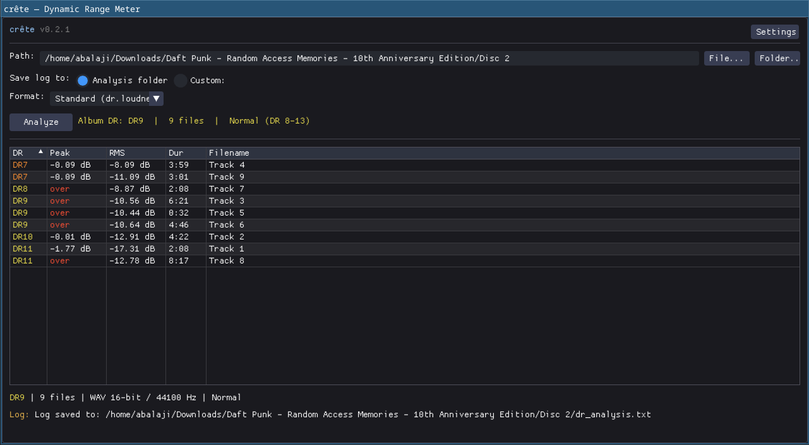
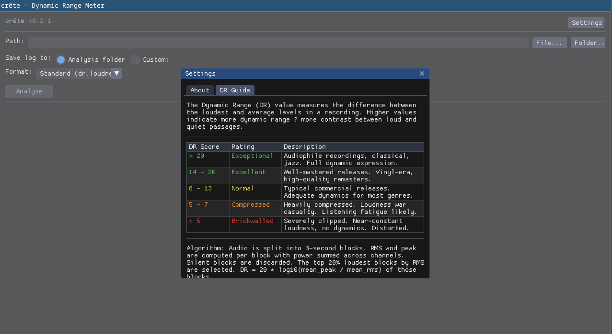
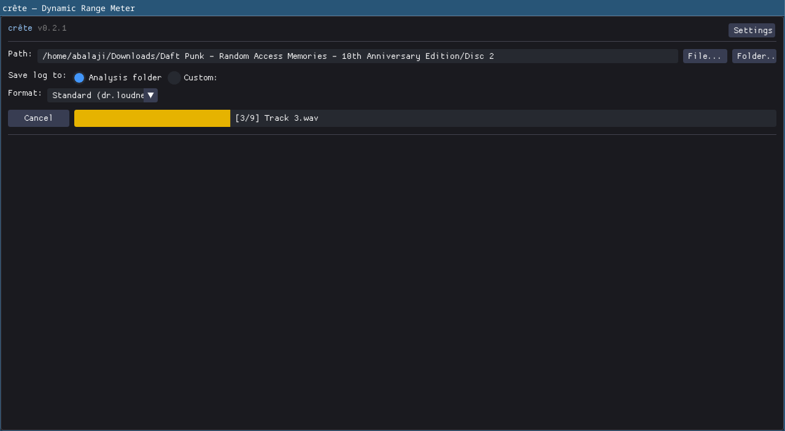

# crête

Zero-dependency C++17 dynamic range meter. The name is French for *peak* / *crest* — the origin of the audio term *crest factor*.

Measures **TT Dynamic Range** (Pleasurize Music Foundation algorithm), **EBU R128 integrated loudness**, and **crest factor** for lossless audio files. Output is compatible with [dr.loudness-war.info](http://dr.loudness-war.info/) submission format.

**NOTE:** --DSD support is flaky and is being actively worked on--. Adding more UI features.

## Build

### CLI (zero dependencies)

```bash
make                    # optimized build
make VERSION=0.2.0      # custom version stamp
make debug              # debug build with sanitizers
make install            # install to /usr/local/bin
```

Single compilation unit, ~1800 lines, no external libraries.

### GUI (Dear ImGui + SDL2)

```bash
# Install dependencies
# Fedora:
sudo dnf install SDL2-devel mesa-libGL-devel
# Ubuntu:
sudo apt install libsdl2-dev libgl-dev
# macOS:
brew install sdl2

# Get Dear ImGui
make setup-imgui

# Build
make gui                # GUI app
make all                # both CLI and GUI
make debug-gui          # debug GUI with sanitizers
```

The GUI binary is `crete-gui`. Features include drag-and-drop, native file/folder dialogs, sortable results table, color-coded DR values, and automatic log file generation.

## Usage

### CLI

```bash
crete --version
crete /path/to/album/
crete -f foobar /path/to/album/
crete -f ext /path/to/album/
crete -o dr_log.txt /path/to/album/
```

### GUI

```bash
crete-gui
```

Browse for a file or folder (or drag and drop), select output format, and click Analyze. Results are displayed in a sortable table with color-coded DR values. A log file is automatically saved to the analysis folder or a custom location.

#### Screenshots

<table>
  <tr>
    <td></td>
    <td></td>
    <td rowspan="2"></td>
  </tr>
  <tr>
    <td></td>
    <td></td>
  </tr>
</table>


## Supported Formats

| Format | Extension | Notes |
|--------|-----------|-------|
| WAV    | `.wav`    | PCM 8/16/24/32-bit, IEEE float 32/64-bit, WAVE_FORMAT_EXTENSIBLE |
| AIFF   | `.aif`, `.aiff` | Standard AIFF and AIFF-C (uncompressed + `sowt`) |
| FLAC   | `.flac`   | Built-in decoder — no libFLAC dependency |
| DSD    | `.dsf`    | Sony DSF format. Decimated to PCM (DSD64→88.2k, DSD128→176.4k) |
| DSD    | `.dff`    | Philips DSDIFF format. Same decimation as DSF |

### Not Yet Supported

**ALAC** (`.m4a`): Requires MP4/ISO BMFF container parsing. Convert first: `ffmpeg -i input.m4a -c:a flac output.flac`

## Output Formats

**Official Album Data:** https://dr.loudness-war.info/album/view/200279

### Standard (`-f std`, default)
Compatible with dr.loudness-war.info submission:
```
abalaji@fedora:~/Projects/Crete$ ./crete -f std /home/abalaji/Downloads/Daft\ Punk\ -\ Random\ Access\ Memories\ -\ 10th\ Anniversary\ E
dition/Disc\ 2/
----------------------------------------------------------------------------------------------                      
 Analyzed Folder: /home/abalaji/Downloads/Daft Punk - Random Access Memories - 10th Anniversary Edition/Disc 2/
----------------------------------------------------------------------------------------------
DR         Peak       RMS        Filename
----------------------------------------------------------------------------------------------

DR11       -1.77 dB   -17.31 dB  01. Horizon Ouverture - Daft Punk.wav
DR10       -0.01 dB   -12.91 dB  02. Horizon (Japan CD) - Daft Punk.wav
DR9        over       -10.56 dB  03. GLBTM (Studio Outtakes) - Daft Punk.wav
DR7        -0.09 dB   -8.09 dB   04. Infinity Repeating (2013 Demo) [feat. Julian Casablancas+The Voidz] - Daft Punk.wav
DR9        over       -10.44 dB  05. GL (Early Take) [feat. Pharrell Williams and Nile Rodgers] - Daft Punk.wav
DR9        over       -10.64 dB  06. Prime (2012 Unfinished) - Daft Punk.wav
DR8        over       -8.87 dB   07. LYTD (Vocoder Tests) [feat. Pharrell Williams] - Daft Punk.wav
DR11       over       -12.78 dB  08. The Writing of Fragments of Time (feat. Todd Edwards) - Daft Punk.wav
DR7        -0.09 dB   -11.09 dB  09. Touch (2021 Epilogue) [feat. Paul Williams] - Daft Punk.wav
----------------------------------------------------------------------------------------------

 Number of Files: 9
 Official DR Value: DR9

==============================================================================================
```

### foobar2000 (`-f foobar`)
Mimics foobar2000 DR Meter 1.1.1 output with duration and technical info.
```
abalaji@fedora:~/Projects/Crete$ ./crete -f foobar /home/abalaji/Downloads/Daft\ Punk\ -\ Random\ Access\ Memories\ -\ 10th\ Anniversary
\ Edition/Disc\ 2/
crête 0.2.1 / TT DR Offline Meter                                               ..                                  
log date: 2026-03-01 12:19:06

--------------------------------------------------------------------------------
Analyzed: Disc 2 / 
--------------------------------------------------------------------------------

DR         Peak         RMS     Duration Track
--------------------------------------------------------------------------------
DR11        -1.77 dB   -17.31 dB     2:08 01. Horizon Ouverture - Daft Punk
DR10        -0.01 dB   -12.91 dB     4:22 02. Horizon (Japan CD) - Daft Punk
DR9          0.00 dB   -10.56 dB     6:21 03. GLBTM (Studio Outtakes) - Daft Punk
DR7         -0.09 dB    -8.09 dB     3:59 04. Infinity Repeating (2013 Demo) [feat. Julian Casablancas+The Voidz] - Daft Punk
DR9          0.00 dB   -10.44 dB     0:32 05. GL (Early Take) [feat. Pharrell Williams and Nile Rodgers] - Daft Punk
DR9          0.00 dB   -10.64 dB     4:46 06. Prime (2012 Unfinished) - Daft Punk
DR8          0.00 dB    -8.87 dB     2:08 07. LYTD (Vocoder Tests) [feat. Pharrell Williams] - Daft Punk
DR11         0.00 dB   -12.78 dB     8:17 08. The Writing of Fragments of Time (feat. Todd Edwards) - Daft Punk
DR7         -0.09 dB   -11.09 dB     3:01 09. Touch (2021 Epilogue) [feat. Paul Williams] - Daft Punk
--------------------------------------------------------------------------------

Number of tracks:  9
Official DR value: DR9

Samplerate:        44100 Hz
Channels:          2
Bits per sample:   16
Codec:             WAV
================================================================================
```
### Extended (`-f ext`)
All metrics in one table — DR, peak, RMS, integrated loudness (LUFS), peak-to-loudness ratio, crest factor, duration.
```
abalaji@fedora:~/Projects/Crete$ ./crete -f ext /home/abalaji/Downloads/Daft\ Punk\ -\ Random\ Access\ Memories\ -\ 10th\ Anniversary\ E
dition/Disc\ 2/
crête 0.2.1 — Extended Dynamic Range Analysis                                   ..                                  
log date: 2026-03-01 12:19:24

------------------------------------------------------------------------------------------------------------------------
Analyzed: Disc 2 / 
------------------------------------------------------------------------------------------------------------------------

DR     Peak       RMS        LUFS       PLR        Crest    Dur       Filename
------------------------------------------------------------------------------------------------------------------------
DR11   -1.77 dB   -17.31 dB  -20.3      18.6 dB    17.6 dB  2:08      01. Horizon Ouverture - Daft Punk
DR10   -0.01 dB   -12.91 dB  -16.5      16.5 dB    15.9 dB  4:22      02. Horizon (Japan CD) - Daft Punk
DR9    over       -10.56 dB  -14.6      14.6 dB    13.6 dB  6:21      03. GLBTM (Studio Outtakes) - Daft Punk
DR7    -0.09 dB   -8.09 dB   -12.0      11.9 dB    11.0 dB  3:59      04. Infinity Repeating (2013 Demo) [feat. Julian Casablancas+The Voidz] - Daft Punk
DR9    over       -10.44 dB  -13.4      13.4 dB    13.6 dB  0:32      05. GL (Early Take) [feat. Pharrell Williams and Nile Rodgers] - Daft Punk
DR9    over       -10.64 dB  -14.2      14.2 dB    13.7 dB  4:46      06. Prime (2012 Unfinished) - Daft Punk
DR8    over       -8.87 dB   -13.0      13.0 dB    11.9 dB  2:08      07. LYTD (Vocoder Tests) [feat. Pharrell Williams] - Daft Punk
DR11   over       -12.78 dB  -16.1      16.1 dB    15.8 dB  8:17      08. The Writing of Fragments of Time (feat. Todd Edwards) - Daft Punk
DR7    -0.09 dB   -11.09 dB  -13.8      13.7 dB    14.0 dB  3:01      09. Touch (2021 Epilogue) [feat. Paul Williams] - Daft Punk
------------------------------------------------------------------------------------------------------------------------

Number of tracks:  9
Official DR value: DR9
Avg. loudness:     -14.9 LUFS

Samplerate:        44100 Hz
Channels:          2
Bits per sample:   16
Codec:             WAV
Verdict:           Normal (DR 8-13)
========================================================================================================================
```
## Algorithm

The TT Dynamic Range algorithm:

1. Split audio into **3-second non-overlapping blocks**
2. Compute **RMS** (power-summed across channels) and **peak** per block
3. Discard silent blocks (RMS < −60 dBFS)
4. Sort blocks by RMS, descending
5. Select the **top 20%** loudest blocks
6. **DR = 20·log₁₀(mean_peak / mean_rms)** of those blocks
7. Round to integer

Additionally computed: EBU R128 integrated loudness with K-weighting and dual gating (ITU-R BS.1770-4), crest factor, and PLR.

## Interpretation

| DR Score | Meaning |
|----------|---------|
| < 5      | Brickwalled — loudness war casualty |
| 5–7      | Heavily compressed |
| 8–13     | Typical commercial release |
| 14–20    | Audiophile / well-mastered |
| > 20     | Exceptional dynamics |

## Project Structure

```
main.cpp          CLI entry point
gui_main.cpp      GUI entry point (Dear ImGui + SDL2 + OpenGL)
analysis.hpp      TT DR, EBU R128, crest factor algorithms
audio.hpp         WAV, AIFF, FLAC, DSF, DFF decoders
file_dialog.hpp   Portable native file/folder dialogs
Makefile          Build system (cli/gui/all targets)
third_party/      Dear ImGui (fetched via make setup-imgui)
```

## License

MIT License — Ashwin Balaji 2026
